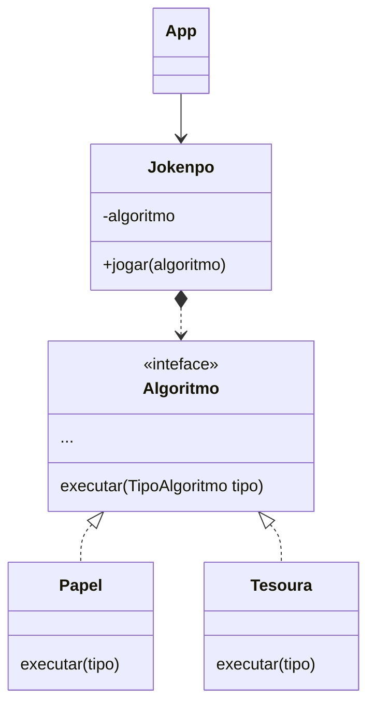

# Strategy

```mermaid
classDiagram
    Algoritmo <|.. Papel
    Algoritmo <|.. Tesoura
    Jokenpo *..> Algoritmo
    App --> Jokenpo
    class Algoritmo {
        <<inteface>>
        ...
        executar(TipoAlgoritmo tipo)
    }
    class Papel{
        executar(tipo)
    }
    class Tesoura{
        executar(tipo)
    }
    class Jokenpo {
        -algoritmo
        +jogar(algoritmo)
    }
```